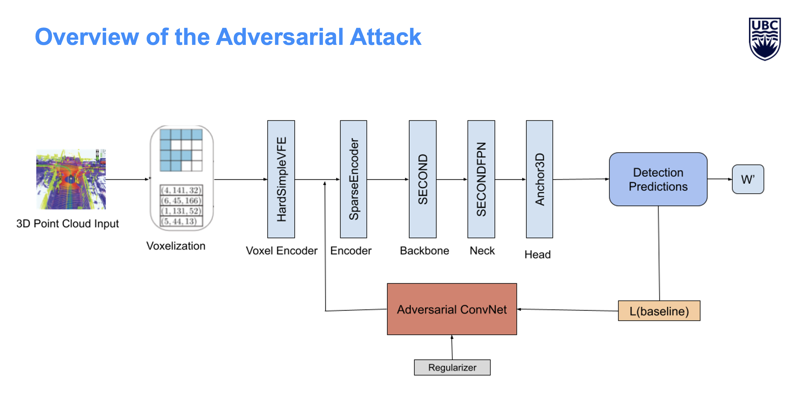
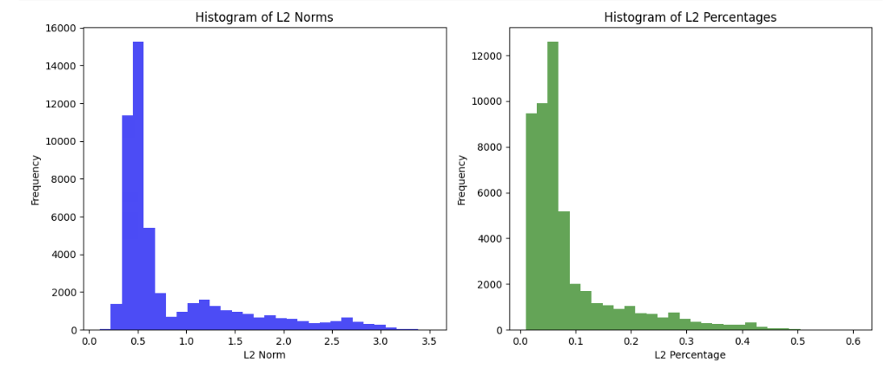

# RobustPointClouds

Adversarial training framework for improving robustness of 3D object detectors against perturbations in point cloud data.

## Architecture



## L2 Norms



## Overview

This framework implements adversarial training for 3D object detection using learned perturbations within physically plausible sensor error bounds. Supports VoxelNet/SECOND for KITTI and CenterPoint for NuScenes datasets.

## Installation

1. Clone the repository
2. Install dependencies:
```bash
pip install -r requirements.txt
```
3. Install MMDetection3D:
```bash
git clone https://github.com/open-mmlab/mmdetection3d.git
cd mmdetection3d
pip install -v -e .
```

## Dataset Setup

### KITTI
Download KITTI 3D object detection dataset and organize as:
```
data/kitti/
├── training/
├── testing/
└── ImageSets/
```

### NuScenes
Download NuScenes v1.0-trainval and organize as:
```
data/nuscenes/
├── samples/
├── sweeps/
├── v1.0-trainval/
└── maps/
```

## Training

### KITTI (3 classes: Car, Pedestrian, Cyclist)
```bash
python train_kitti_3class_adversarial.py --validate
```

### NuScenes
```bash
python train_nuscenes_adversarial.py --validate
```

## Evaluation

### KITTI
```bash
# Baseline evaluation
python evaluate_kitti_3class.py --mode clean

# Adversarial evaluation
python evaluate_kitti_3class.py --mode adversarial

# Both
python evaluate_kitti_3class.py --mode both
```

### NuScenes
```bash
# All modes
python evaluate_nuscenes_adversarial.py --mode all
```

## Key Components

- **VoxelPerturber**: Generates bounded adversarial perturbations
- **AdversarialVoxelNet**: SECOND-based detector with adversarial training
- **AdversarialCenterPoint**: CenterPoint with adversarial training

## Configuration

Main parameters in config files:
- `adversarial_loss_weight`: Adversarial loss weight (default: 0.1)
- `regularization_weight`: L2 regularization (default: 0.05)
- `sensor_error_bound`: Max perturbation in meters (default: 0.2)
